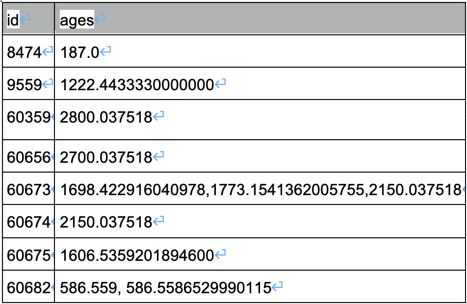
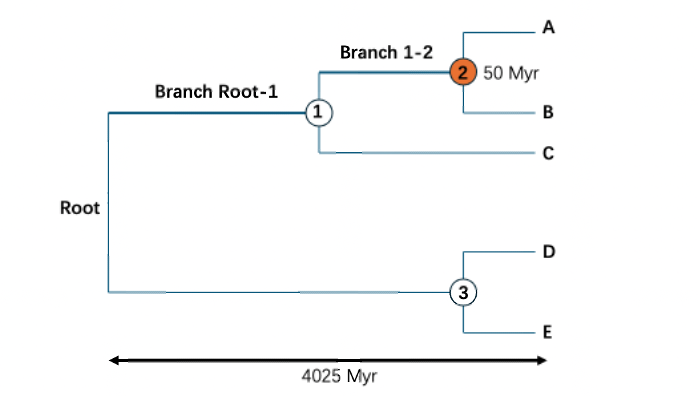

Phylogenetic-Diversity-across-the-complete-tree-of-life

Here I provide codes to run the functions, read in the original tables include ordered_leaves, ordered_nodes and the json field collected from Open Tree of Life, calculate evolutionary distinctiveness and phylogenetic diversity.
The code based on R version 4.4.2 and Python 3.10.9

# read_json_get_date_dataframe.py
The input file is the json data which comes from the Open Tree of Life. In this file, each one or two OTT_IDs have a date estimate. The original data looked like this: "mrcaott119219ott212182": [{"source_id": "ot_534@tree5", "age": 40.051873, "source_node": "node665"}, {"source_id": "ot_409@tree1", "age": 54.020365, "source_node": "node18041"}], "mrcaott12995ott26078": [{"source_id": "ot_534@tree5", "age": 56.874824000000004, "source_node": "node606"}, {"source_id": "ot_809@tree2", "age": 69.623766, "source_node": "node23454"}, {"source_id": "ot_534@tree7", "age": 58.020022, "source_node": "node892"}, {"source_id": "ot_531@tree1", "age": 58.414834, "source_node": "node127"}]. The information we need is ott_ID and date estimates: mrcaott119219ott212182, {“age”: [40.051873, 54.020365,]}; mrcaott12995ott26078, {“age”: [56.874824000000004, 69.623766, 58.020022, 58.414834]}.
In this part, ott_ID comes from the Open Tree of Life, leaf_ID and node_ID comes from the leaves_table and nodes_table generated by the OneZoom.
First, we deal with the list of date estimates that correspond to two ott_IDs.
In this data, if two ott ID have a list of date estimate, we will check whether these ott_IDs belongs to a leaves or nodes. Then, we will go through the leaves_table and nodes_table, which includes the structure information of the tree of life and find the most recent common ancestor of this two ott_ID. Note that this common ancestor must not be nodes that are generated from the randomly resolve process of the OneZoom. After checked this, we will give the list of date estimates to this most recent common ancestor.
Then, we deal with the list of date estimates that correspond to only one ott_ID. This indicates that this date estimates belongs to the node that has this ott_ID. Therefore, we directly give the date estimates to this node.
By running #read_json_get_date_dataframe, you will get a table of node date estimate in which each node id will have either one or a list of node date estimates.

# ED&PD_for_hpc.py, ed_generater.sh, ed_submitter_IC.sh, ed_arrangement.py
These scripts will calculate ED score for the entire leaves table, and PD scores for monophyletic clades (real parents only). The input file of this script is a leaves table and a nodes table which includes the structural information of the tree of life (updated_ordered_nodes_2.0.csv, updated_ordered_leaves_2.0.csv), and the table of node date estimates generated by the #read_json_get_date_dataframe.py. Leaves here refer to species and nodes refer to ancestors.
In the #updated_ordered_nodes_2.0.csv, each node has a node ID, and a parent column shows its most recent common ancestor, and a real parent column to show whether this parent is generated through the random resolve process in OneZoom. Another important part is leaf_lft and leaf_rgt, these two columns will give us the exact number and species of the descendants of this node. By combining this table with the node date table (latest_node_dates(real_parent)_2.0.csv) generated by the previous step, we will have a complete node table includes both tree structural information and date estimates. The leaves table includes the name, leaf_ID and the ott_ID of this species. The leaf_ID will help us to relate this leaf with its parent node. The parent column shows its most recent common ancestor, and a real parent column to show whether this parent is generated by random resolving. These information can help us to estimate the ED score of a leaf.
To minimize the time of estimation, we first combined the leaves that have the same most recent common ancestor, because that means these two leaves will have the same ED score. For example, species A and B, D and E in this figure. The combined leaves table is named as leaves2 in the submitted code.
When we are calculating ED score, we have to overcome the data deficiency. For example, in this below figure, we only know the root of the tree of life is 4025 Myr ago, and the date estimate of node 2 is 50 Myr.
Then we calculate ED based on the following step:
1.  	Create an empty list to store the weighted branch lengths ([])
2.  	For A and B, its terminal branch is 50 Myr, so we add this to the list. In ED estimation, the terminal branch connect the species to its most recent common ancestor does not need to be weighted. Now the list is [50].
3.  	Date estimate of node 1 is missing, so we keep finding its ancestor until we get a date estimate larger than 0. (In this example, it is the root of the tree of life, 4025 Myr).
4.  	We calculate the average branch length from the root to the node 2 to represent the branch length of Root-1 and 1-2, which is (4025-50)/2.
5.  	These two branches must be weighted by the number of species which are descended from it. For branch 1-2, its weighted length is 1/2*(4025-50)/2, and for branch Root-1, its weighted length is 1/3*(4025-50)/2
6.  	Now the list looks like: [662.5, 993.75, 50]. Sum of this list will give us the ED score of species A and B.
To estimate the total unique PD of a clade, we can sum the ED scores of all species within the clade, and then subtract the contribution of the ED score from the most recent ancestor shared by the clade’s common ancestor, multiplied by the species richness of the clade. For example, in the above figure, the total unique PD of clade 2 is (4025-50)/2+50*2, which is 2087.5Myr. It is also equal to (662.5+993.75+50)*2-2*(4025-50)/(2*3) = 2087.5Myr.
In order to capture a measure of uncertainty based on data deficiency, we conducted jackknife analysis by randomly removing 50% of node date estimates and using the rest of the data to perform all the analyses - repeating the process 1000 times. We achieved this with the help of HPC. In the three scripts provided above, #ed_generater.sh can generate series of scripts that can assign a random seed to #ED&PD_for_hpc.py and run ED&PD_for_hpc.py cluster. 1000 random seeds will generate 1000 shell scripts and submit them one by one will be time consuming. In this case, we use #ed_submitter_IC.sh to submit them at the same time. After estimation, the cluster will return series of *.part file. By downloading them and run merge *.part > jackknife _all.csv, you will be able to get a data frame with ED and total unique PD values. The input files of #ED&PD_for_hpc.py are updated_ordered_leaves_2.0.csv and updated_ordered_nodes_2.0.csv, which are 
 originally generated by the OneZoom tree of life, and latest_node_dates(real_parent)_2.0.csv, which is generated by #read_json_get_date_dataframe.py. All the random seeds we used are provided in a file named random_seeds.xlsx. The above scripts will return 1000 *.part file, each of which composed of 2 rows, the first row is a list of ED scores of all described life, the second row is a list of total unique PD scores for interior nodes. All random seeds we use for this study were provided.(see **random_seeds.xlsx**).
 After all ED and PD scores are calculated, ed_arrangement.py will arrange the data and give a dataframe of ED values and a dataframe of PD values.

# Test_ED&PD_estimation.py
This code is a demo that performs a single time of estimation of ED and PD on your computer. It will take about 7~8 hours and the required datasets are updated_ordered_leaves_2.0.csv, updated_ordered_nodes_2.0.csv and latest_node_dates(real_parent)_2.0.csv, which are available in https://zenodo.org/records/16810118, and latest_node_dates(real_parent)_2.0.csv, which is available at https://zenodo.org/records/16931365.

# ed_median.py, pd_median.py, pd_median_submitter.sh, ed_median_submitter.sh 
The code ed_median.py and pd_median.py will give median ED/PD values among the 1000 replicates. ed_median_submitter.sh and pd_median_submitter.sh can help submit the ed_median.py and pd_median.py to cluster.

# estimate_proportion_of_dated_nodes.py, tree_structure_for_sampled_nodes.py
To further explore the distribution of ED scores across other clades, we divided all monophyletic clades into 6 groups based on their log transformed species richness (group 1: 1-2, group 2: 2-3, group 3: 3-4, group 4: 4-5, group 5: 5-6, group 6: above 6). Then we randomly sampled 4 clades within each group. The script #estimate_proportion_of_dated_nodes.py can estimate the proportion of dated nodes for all nodes and it will return a csv file named “df_nodes_with_proportion_of_dated&realparent.csv”. All the nodes for sample must have at least 1 dated nodes. 
The script #tree_structure_for_sampled_nodes.py can arrange these selected nodes into a tree structure based on their phylogenetic position. The input data of this script is the dataframe of nodes we sampled from df_nodes_with_proportion_of_dated&realparent.csv and the original nodes table named updated_ordered_nodes_2.0.csv. This script will return a newick format file named tree_output.nwk. Our R script named figure_scripts.R will visualize the newick format file. 

# threatened_pd.py, threatened_pd_submitter.sh
If a species extinct, the unique evolutionary history represented by this species (represented by the length of terminal branch connect this species to its most recent ancestor) will loss. If a whole clade of species extinct, the total unique PD represented by this clade will loss. By dropping all threatened species (VU, EN and CR species) from a given tree and subtracting the resulting PD from the original full PD, # threatened_pd.py can estimated the threatened PD of monophyetic clades. The input data of this code is “updated_ordered_leaves_2.0.csv”, “updated_ordered_nodes_2.0.csv”, “latest_node_dates(real_parent)_2.0.csv” and “ed_values.csv” which include 1000 ED values for each species. the output of this file will be data frames include threatened PD values for selected clades. By considering data deficient species as threatened species, we also make an estimation of threatened PD in a worse situation. This can sometimes greatly increase the estimated value of threatened PD for those less studied clades. The script #threatened_pd_submitter.sh can help submit the # threatened_pd.py to cluster.

# phyloinfo_for_edge20_species.py
This code will find all ancestors(node) for each species among the top 20 EDGE species. Then it calculate the ED scores of this node.

# figure_script.R 
All the figures in this paper (except figure 5 and figure S1) were generated through this code. All input files required for this script is provided with the manuscript. All datasets for making figures are available here: https://zenodo.org/records/16879538.
